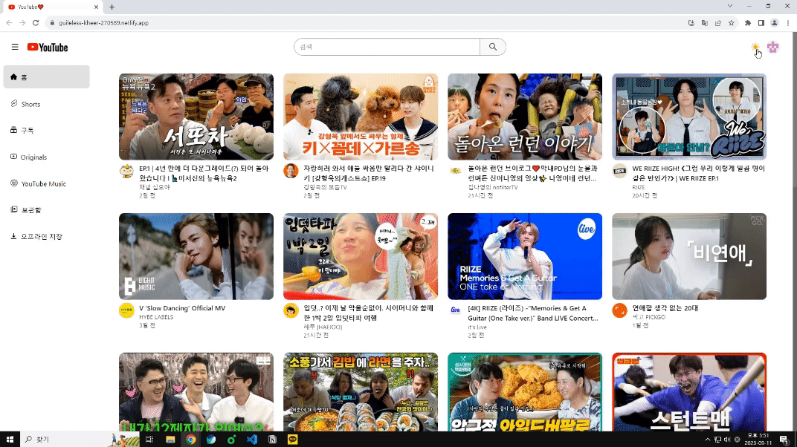
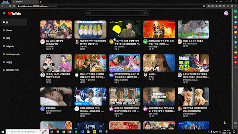
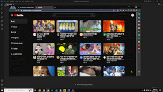
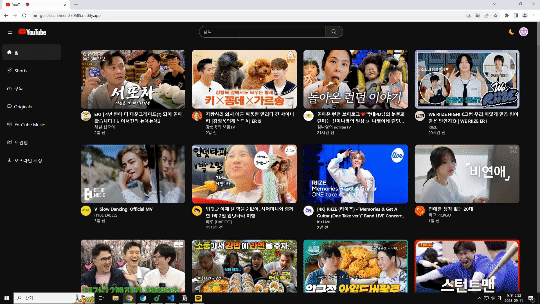
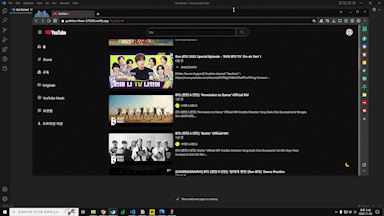
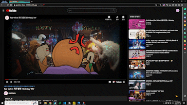
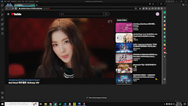

# youtube clone

## [클릭😊](https://guileless-kheer-270589.netlify.app/)

### 목적

React 18, React Router, React Query(TanStack Query), Tailwind, YouTube Data API, Axios 등 사용법 익히기

### 화면 구성

- 유튜브 데이터는 React Query(TanStack Query)와 Axios를 사용하여 받아왔다.
- 라우터 설정은 React Router를 사용하였다.
- css 작업은 Tailwind를 사용했으며 다크모드 라이트 모드를 구현했다.
  

  
  

- 최상단에 있는 버튼을 누르면 나타나는 메뉴와 비디오상세페이지를 제외한 모든페이지에 나타나는 기본 메뉴를 구현하였다. 홈 부분을 클릭하면 홈으로 이동한다.
  

  
  

- 홈

  - 인기 동영상들을 보여준다.
  - 스크롤을 내리면 더 많은 인기 동영상들을 보여준다. 정말 무한으로 계속 인기 동영상들을 더 보여주고 싶었지만 안타깝게도 유튜브는 하루 할당량이 정해져 있다.
  

    
    
  

  - 브라우저 사이즈에 따라 반응형으로 구현하였다.
    

    
    

  - 각각의 비디오를 선택하면 그 비디오의 상세페이지로 이동하게 된다.
    

    
    

  - 오른쪽 상단 버튼을 누르면 메뉴가 나타나고 홈을 누르면 홈으로 이동한다.
    

    
    

- 검색

  - 제일 상단에 원하는 검색어를 입력하면 검색어 관련된 영상들을 보여준다.
  - 스크롤을 내리면 추가적으로 동영상들을 보여준다. 정말 무한으로 계속 인기 동영상들을 더 보여주고 싶었지만 안타깝게도 유튜브는 하루 할당량이 정해져 있기 때문에 아주 많이 보여주지는 못한다...
    

    
    

  - 원하는 영상을 클릭하면 그 영상의 상세페이지로 이동한다.
  - 제일 상단에 위치한 검색창과 영상 리스트는 화면의 크기에 따라 반응형으로 동작한다.
    

    
    
    

- 비디오 상세페이지
  - 유튜브 영상, 영상의 channelTitle과 관련된 영상, 비디오 상세정보, 댓글을 구현하였다.
    

    
    

  - 화면의 크기 변화에 따라 반응형으로 구현하였으며 일정 크기 이상으로 화면이 작아지면 관련 비디오가 비디오 상세정보 아래로 내려가게 된다.
    

    
    

### 개선할 사항

- [x] Infinite Queries로 스크롤이 일정 위치로 가면 유튜브 데이터를 더 불러오게 구현 -> 하루에 사용 가능한 할당량이 적다보니 전부다 적용하기는 힘들었다. 특히 검색 기능을 이용해 데이터를 불러오는 부분이 많기 때문이다. 그래서 홈 화면의 비디오 목록들과 검색 결과만 조금 더 보여주도록 구현하였다.
- [x] 로딩 관련 UI 수정 -> 나름 스켈레톤 UI를 만들어서 일부 페이지만 적용해 보았는데 조금 어색한 부분이 있지만 크게 문제 없이 동작하는 것 같다. 프로젝트에는 크게 의미있는 것 같지는 않지만 새로운 것을 배웠다는 것에 의미가 있는 것 같다.
- [x] relatedToVideoId 매개변수 지원 종료로 인해 비디오 상세페이지 관련 영상을 channelTitle 관련 영상으로 변경
- [x] NotFound 화면 수정
